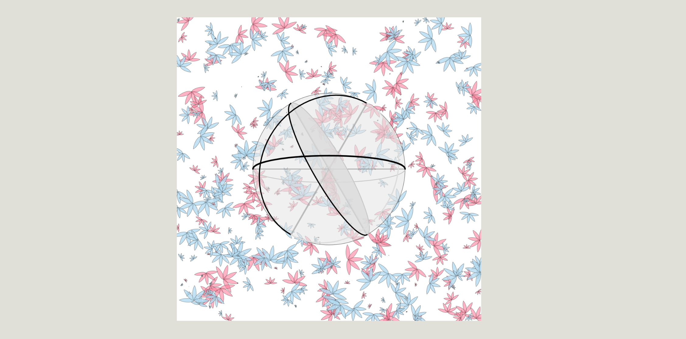

## Process

Description of the contents of this folder and the logic of your data → retinal variables mapping.

-----------------------

### Time Concept 1: Moving lines/planes

[This concept](Antonie_TimesConcept1.pdf) uses moving lines to indicate time. The retinal variable mapping
is done using **position**. 

Whereas this idea might seem very simplistic, the idea is to expand the presentation 
of time in different dimensions; i.e. lateral for seconds, vertical for minutes
and depth for hours (not shown). The third dimension would require 
experimentation to investigate implementation into p5.js using WEBGL.

The expectation is that even though the retinal mapping starts out as **position**,
it ends up becoming **area**, since the box expands into different dimensions, 
giving a sense of the substance of time (related to area or **volume** or weight).

This is the final implementation:

-----------------------

### Time Concept 2: Spiral

[The spiral concept](Antonie_TimesConcept2.pdf) relies on **position** (cross-mapped with **size/orientation**)
to indicate passage of time. It uses the age old aspect of orientation 
(rotation) in one axis, coupled with height (or pitch) in another.
This plays on the idea that time in seconds, 
minutes and hours are permanently linked by a fixed ratio.

The implimentation would be 2D, creating a 3D feel using:\
x = R cos(A*time);\
z = R sin(A*time);\
y = f(time);

where x is horizontal, z "into" the screen and y vertical.
Some experimentation is required with scaling the sines and cosines to represent 
an aesthetically pleasing spiral.
A secondary aspect that might be added is lines connecting some origin to the 
spiral. These lines might be coloured and could possibly add a dimension of **hue**.

This is the final implementation:

-----------------------

### Time Concept 3: Opaque Inverted Pyramid

[The inverted pyramid](Antonie_TimesConcept3.pdf) would be either a 2D illusion of an inverted pyramid, 
viewed from above as squares, or a real 
3D representation of a pyramid (depending on p5.js functionality).

The retinal variable mapping would be **area** (size) and **value** (opacity).
The idea is to create an illusion of a bowl that get filled with murky 
water (viewed from above); which would be similar to opaque sheets of glass 
that get stacked on top of each other.
Every hour that passes would obscure a level (step) of the inverted pyramid and 
create the sense that the object is growing (**area**).

This is the final implementation:

-----------------------

### Date Concept 1: Gear and slider (Rack and Pinion)

[The rack and pinion](Antonie_DatesConcept_1.pdf) idea is to represent the day of the the week and month
by **rotation** and **translation**. The idea is to have a fixed ratio defining the passing
of weeks and months, which might have some indicator on the gear and horizontal slider.

The gear angle (rotation) would be mapped from the day progress variable and the slider
x-coordinate (lateral position) would be mapped from the month progress variable.

This concept has limitations if the length of the slider is fixed. 
However, it would likely by beneficial to extend the 
slider to stretch infinitely to each side (and off screen) and indicate position
using a mark on the slider. The fixed
ratio is not applicable to months with different days, hence the idea
is to move it to both sides (oscillating slowly) from left to right and right 
to left; each direction corresponding to a different set of days. February
would imply the slider doesn't move so far; i.e. 28 (or 29 days) instead of 31.

This is the final implementation:

-----------------------

### Date Concept 2: Polygon Sides and Size

[This concept](Antonie_DatesConcept_2.pdf) uses **shapes** and **sizes** to indicate days of the week and days
of the month. Days of the week would be represented by the amount of sides on the 
shape (a polygon). Stars could also possibly be used, in which case the number
of vertex points would correspond to the day of the week.

The question of a 1-sided and 2-sided shape would be solved by using a point and 
a line, before adding sides to become a triangle, square...etc.

Advances in weeks on the calendar would be done by stepping up the size (and line thickness)
of the shape (coupled to the day/week of the month.)

This is the final implementation:

-----------------------

### Date Concept 3: Organic seasons and years

[The idea](Antonie_DatesConcept_3.pdf) is to use **hue** and **texture** to represent seasons and years.

The season would be mapped to a colour spectrum where black/darkbrown "branches" 
represent winter, light green dots (with "pink/purple blossom dots") represent
spring, deep green circles (large dots/leaves) represent summer and 
fall coloured leaves represent autumn. 

The texture would be bound to the twig/leave
intensity (i.e. number of marks per square unit) as well as the size of these dots
in order to create the visual impression of gradual transition.
This transition would be mapped to a continuous spectrum.
Experimentation with background colour would include changing from a dull grey
to deep blue (depending on colour clashes), in order to represent the "backdrop 
of the tree branches/leaves" against the sky.

Another variation from this theme is to add years through an organic year ring.
This year ring could possibly be the center of the canvas. The rings might also 
be combined with shapes to create a rendundant indication of the amount of years.

This is the final implementation:

-----------------------

### Final Concept 1: Multiple variable

[The idea](Antonie_FinalConcept1.pdf) is to combine as many retinal variables
as possible and here to use **fill/opacity** and **size** to represent passing of
time. The day/week will be represented by **shape**, with the number of the days
in the week corresponding to the amount of sides on a polygon. This might
be problematic for day 1. 
Seasons will be represented by the **colour/hue** of the background texture fill.

-----------------------

### Final Concept 2: Cone

[The idea](Antonie_FinalConcept2.pdf) is to combine as many retinal variables
as possible and here to use **position** and **orientation** in a mechanism-type
visualization to show the passing of time.
The surrounding border will employ a more naturalistic approach and use 
**texture** and **color/hue** to show passing of the seasons.

-----------------------

### Final Concept 3: Gear

[The idea](Antonie_FinalConcept3.pdf) is to uses the retinal variables
of **position** and **orientation** in a mechanism-type
visualization using various moving parts to show the passing of time and date.
This mechanism uses a rack-and-pinion gear to show weeks, and lines overlayed
from the initial time concept 1 to show time of seconds, minutes and hours.

-----------------------

### Final Implementation: Times and Dates using multiple variables

The final version combines the mechanism concept in the centre of the viewport with 
more naturalistic backdrop. The time is represented with the ball in the center and
seconds, minutes and hours mapped as retinal variables of **position** and **orientation**
through the use of Bezier curves. The Bezier curves simulate a 3D sphere by changing
the control points on the Bezier curve which effectively starts out by drawing a 
half circle and then collapsing it to a straight line, after which the Bezier curve
control points then move to the other side of the line to expand toward another half 
circle. The opacity and colour of these lines are then changed based on their odd
or even count to simulate being in front of or behind the "transparent" sphere.

For calendar variables of day/night, day of the week and month/season the background
is mapped to the retinal variables of **color**, **texture** and **shape**.
When time is AM, the background is white and PM it is slight grey.
The leaves get drawn by the amount of leaves per weekday, hence the 1st day of the 
week has all the leaves scattered as 1 per location. The 2nd day of the week has
2 leaves per clump, etc. until there are 7 leaves per group. Groups are 
randomly scattered using a predefined randomized position coordinate array that
is generated in the P5 setup function before calling the draw function (to save
processing time). 
As the months and seasons change, leaves are randomly added or removed and transition
inbetween different colours to indicate the change of season. Hence there will almost
always be a spread of two colours in the background leaves, depending on which 
season is transitioning to which other season.

The final implementation is shown below.

