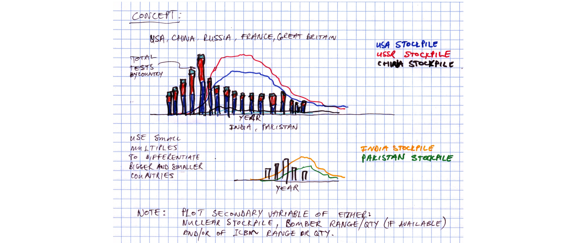
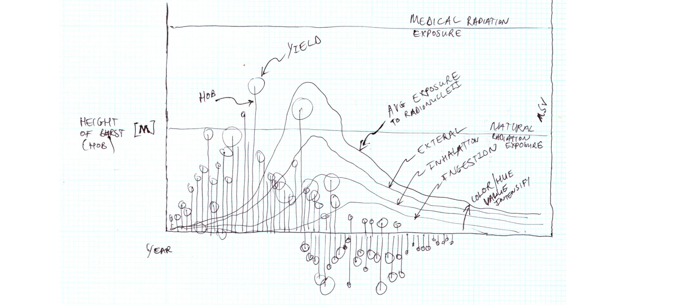
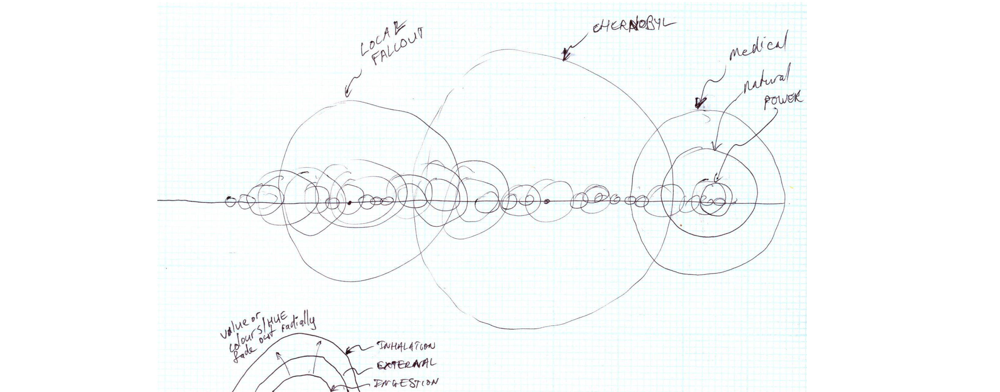
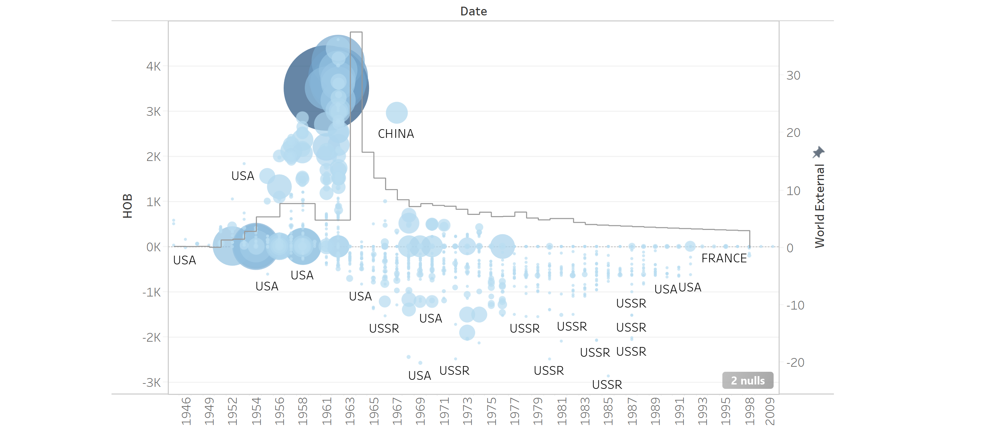
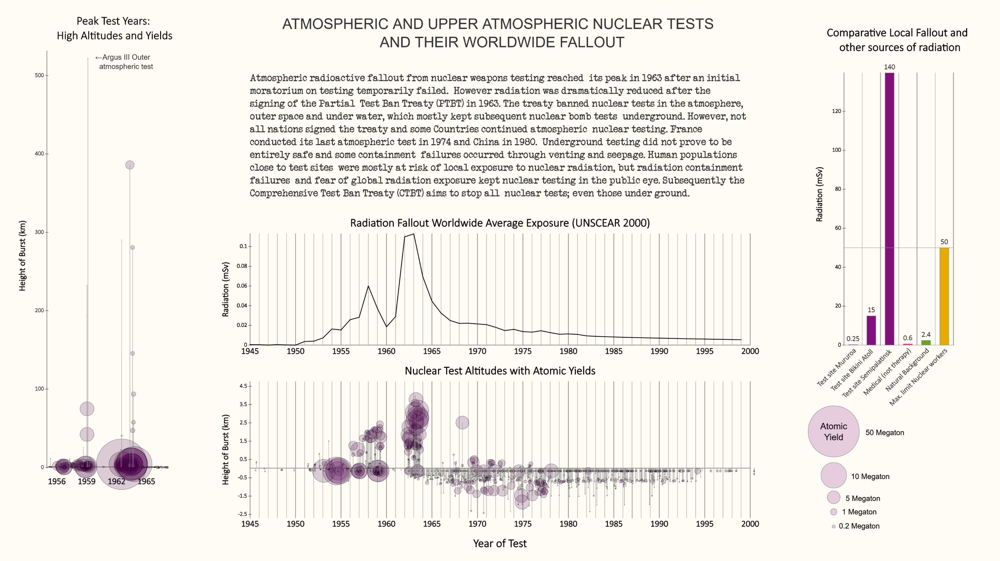

## Process

Description of the contents of this folder, a prose description of your ideas for how to represent
the nuclear testing time series, and links to external data sources you'll be incorporating into
the project.

### Initial Exploratory visualizations of the base dataset:
------------------------------------------

Using standard google spreadsheet data supplied as part of the assignment,
various perspectives on the dataset of Nuclear tests were investigated.

Firstly the number of Nuclear test by country were investigated spanning over
the whole time/date range. It was found that the USA and Russia were the main
contributors to overall testing and that France followed these countries, but only
at a later stage during the late 70's up until the early 90's, after which mostly
all testing ceased.

When the time aspect is ignored and a barchart of tests by country is plotted,
the overall number of tests per country becomes more visible, however
this is done at the loss of time-based data. Hence other visualiztion techniques should
also be considered that would retain the time dimension of the dataset.

Plotting the overall number of tests grouped above and below ground reveals very interesting
patterns of when the Partial Test Ban Treaty was signed that mostly stopped atmospheric 
tests. Unfortunately when aggregating the dataset to all countries the fact that 
countries such as France continued atmospheric testing (since France didn't sign the
treaty) is not fully visible. However, plotting the above-ground and below-ground
tests in this way seems very appealing. Mapping of **size**, **shape** and **hue**
is used.

### Initial Sketches:
------------------------------------------

The initial sketches included ways to visualize the dataset and also to 
add external data. Various external datasets were considered for this part of the 
project and these are explained below.

#### Sketch 1:

This concept consists of plotting the total number of nuclear test occurences 
for all countries as a bar chart and overlay additional included data from 
atmospheric contents of [Cesium-137](https://cds.cern.ch/record/2669354/files/1725248_287-294.pdf) 
and/or [Carbon-14](https://en.wikipedia.org/wiki/Bomb_pulse).
The aim would be to show the direct effect of atmospheric nuclear testing on the
amount of radio-isotopes in the atmosphere.
The main challenge of this concept is that it plots two units on one axis system,
and one might wonder if there isn't a better way to show the relationship.
Retinal variables of **position** is the main mapping, however **hue** will be used
to distinguish different types of variables.

#### Sketch 2:

This concept aims to inspect detail of each test for each country
by including parameters such as the mushroom cloud height and crater depth
to map data elements to **size** and **shape**.

The visual language would include drawing the explosion as a mushroom graphic 
according to size and scale of the nuclear test parameters.
Crater size and depth can then also be considered and shown as triangular elements
toward the bottom. The main challenge is that crater width then cross-couples on 
the time axis, however depth could be shown vertically by adjusting the size of 
the crater.

Datasets that could be included would focus on the [largest explosions](http://www.johnstonsarchive.net/nuclear/tests/multimegtests.html)
and/or [high-altitude explosion magnetic field strength](http://www.johnstonsarchive.net/nuclear/hane.html),
since these are factors that might be relevant to large explosions.
The yield of the explosions can also be related to the retinal variable of element/icon **size**.

#### Sketch 3:

This concept sketches will retain the use of a bar chart that plots total number
of nuclear tests by country, but will stack the bar chart to show the contribution
of each country toward the total number of tests. The split will be identified using
the **color/hue**.

The secondary dataset could consist of military weapon stockpiles to show the arms race.
The main difference between this concept and the previous one would include the use of small
multiples to differentiate between the larger countries such as USA and Russia and smaller
countries such as India and Pakistan, since plotting all of these on one chart makes it 
difficult to distinguish the effect of the smaller countries.
THe addtional dataset that will be explored would be the more complex task of the 
[nuclear arms race](https://en.wikipedia.org/wiki/Nuclear_arms_race) of testing together with delivery systems; 
the [bomber gap](https://en.wikipedia.org/wiki/Bomber_gap) and  [missile gap](https://en.wikipedia.org/wiki/Missile_gap).
It is not clear if a fully representative dataset for all countries will be available.

#### Additional Sketches:

After investigating available datasets, additional rough sketches were made to relate initial
concepts to the real data. These include:

Plotting the Height and Depth of burst from the supplied 
[Johnsons Archive](http://www.johnstonsarchive.net/nuclear/tests/index.html) dataset
as main visual graphic. Each explosion height would be mapped to the retinal
variable of **position** and the magnitude/yield as circle **size**. 
A selection of line charts will be overlayed to show data from the Unitated Nations Scientific
Committe on the Effects of Atomic Radiation ([UNSCEAR data](https://www.unscear.org/unscear/en/publications.html)) reports.
These will be broken into categories of external and internal exposure (e.g. inhalation and ingestion
and/or Northern or Souther Hemispheres).

Another visualizion would consist of comparisons between different sources of radiation
using the same [UNSCEAR data](https://www.unscear.org/unscear/en/publications.html) dataset.

Lastly a consideration is given to create a clearer distinction between different variable
sets by plotting explosions as spheres and radition exposures as a stepped line/bar chart.

### Initial Code-based implementation:
------------------------------------------

#### Initial coded sketch:

The first code based implementation consisted of writing graphing functions in 
P5.js that allows plotting barcharts and linecharts. These functions load the 
CSV data and plots it given chart position and axes parameters.
The code is supplied in the /project folder.

#### Coded sketch concept 1:

The first coded example imported the [UNSCEAR data](https://www.unscear.org/unscear/en/publications.html)
from the year 2000 into a visualization that plotted mulitple line charts and small multiples.

#### Coded sketch concept 2:

The 2nd coded example imported the [UNSCEAR data](https://www.unscear.org/unscear/en/publications.html)
from the year 2000 into a visualization that plotted mulitple bar charts and small multiples.

#### Coded sketch concept 3:

The 3rd coded example imported the [UNSCEAR data](https://www.unscear.org/unscear/en/publications.html)
from the year 2000 into a visualization that plotted a bubble chart showing radiation
and mapping the radiation intensity level to circle **size**, fill *hue* and **opacity**.

These functions would be subsequently used as building blocks for the final visualization.

### Final Visualization:
------------------------------------------

The final visualization combines the 
[Johnsons Archive](http://www.johnstonsarchive.net/nuclear/tests/index.html)
dataset as well as the UN
[UNSCEAR radiation data](https://www.unscear.org/unscear/en/publications.html)
in a visual that combines line charts, bar charts, small multiples and bubbles.

