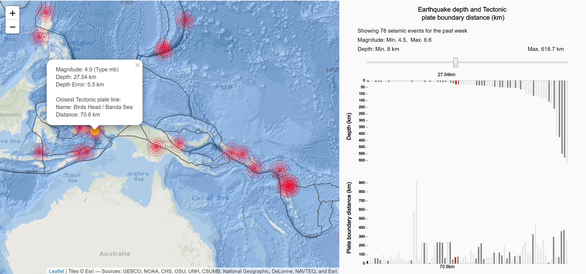

## Process Documentation
----------------------

Stones unturned: Project 3: Mapping earthquake data onto a map

This section relates to the concepts of showing non-spatial data before applying it to
the spatial map.

-------------------------

### Concept 1:

The first concept relies on conveying the information of earthquake depth and/or magnitude
through the retinal variable of **shape** and **size* directly onto the map as a marker.
The idea is to create an icon that will show the value type through a visual 
language related to earthquakes (i.e. a crack in the ground or a vibration wave.)

### Concept 2:

The 2nd concept is to show the depth and depth uncertainty values over time by using the retinal
variables of **position** and **length** respectively. For this purpose a bar will be 
drawn on a set of axes normal x- and y- axes. 
The vertical position of the bar will indicate the depth, whereas the length
will indicate the margin of uncertainty related to depth (i.e. earthquake depth error.)
It is also envisioned to possibly map the earthquake magnitude as **colour/hue**.

### Concept 3:

The final concept is a traditional grouped bar chart that shows the 
earhquake frequency vs. magnitude for earthquakes over the past 4 weeks (1 month).
Categorical colour mapping would be used to indicate which period each bar belongs to.
Whereas this concept does add the ability to relate magnitude and no. of occurences
more directly, the benefit of having a direct time history is lost.

-------------------------------------

### Final Implementation:
--------------------

The final implementation default view is shown below. The main map is shown on
the left-hand side and implemented with Leaflet.js. The area on the right is
a P5.js canvas that plots two bar charts; firstly for the earthquake depth and
secondly for the earhquake distance toward the closest tectonic plate boundary.
Tectonic plate boundary lines were imported from [here](https://github.com/fraxen/tectonicplates)
in GeoJSON format and added to the map as a separate map layer. Distances from
seismic events to these boundaries were calculated using code from provided 
course material examples.

It was decided to modify the initial marker concept by adding markers that resemble
seismic waves. Concentric circles are used to create the visual effect of the
vibrations circling out from the earthquake epicentre. The scale of the
circle maximum diameter is mapped to the retinal variable of **size** with
the base color of red to create a contrast to the background of the ocean. 
Furthermore, the circles are plotted with some transparency in order to overlay them
and show density of many that overlap on a given location.

A primary focuspoint of the design is an interactive interface that allows the user
to cycle through the individual events using a slider above the chart area.
A slider was chosen instead of a mouseover/hover functionality to aid development
and increase selection reliability. Simple bar charts are used to aid in simplifying
user interaction by highlighting bars in the top and bottom chart that 
correspond to a single seismic event.

A secondary filter was also built into the chart
whereby the Map pan and zoom would result in highlighting 
only bars that correspond to seismic events that are on the map view.
Both the slider selection and map view selections were implemented by
adding `IF` statements in the P5 draw loop to change the fill color of a bar
when that bar corresponds to either the associated slider value and/or when it
falls into the range of coordinates that are in the map window rectangle (inbetween
the South-West and North-East corners). 

Since each of the bars has to be
drawn in every draw loop irrespective of their color, only the fill color
for that bar is changed based has to be updated, where the selection criteria 
consist of it being in the map window, outside the map window, or corrsponding to the slider selection.
Currently the marker in the map view will follow the slider as part of
Leaflet base functionality, however the slider does not follow the map click event.
A future improvement could be to also bind the slider position to a clicked
marker.

Additional information is also made available to the user through a popup menu on each
marker that contains the relevant information, as well as the distance line toward
the closest tectonic plate boundary. Since the highlighted marker and line need to dynamically
update with the slider selection, the `L.icon` and and `L.polyline`
is added only once in the setup function and then their latitude and longitude
are updated in every draw loop at 10 frames/sec. The updating the marker properties
rather than adding new ones and removing them is deemed more efficient, even though 
an even better approach might be to use other Javascript methods to communicate inbetween
leaflet and P5.

Seismic events with magnitude greater than 4.5 and only for the past week are loaded
from the USGS site by constructing a filename string using different parameters
for event size and historic timeframe.
The charts are programmed to be able to handle any variation on the data,
however when many events are present the bars could become to thin or too thick
for a pleasant user experience. Hence, the default of events with magnitude greater
than 4.5 for the past week is deemed most optimal.

View for seismic events above 4.5 magnitude for the past day:

View for seismic events above 4.5 magnitude for the past month:

